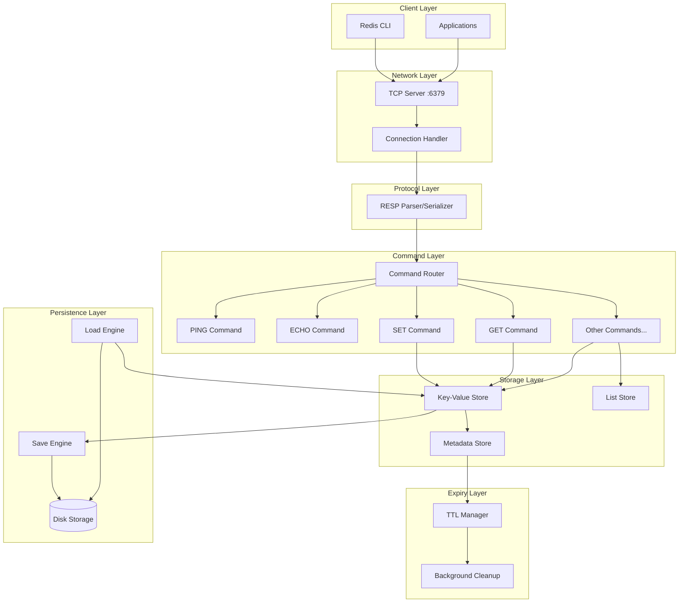

# Redis-Lite Server Architecture

## Overview

Redis-Lite is a simplified Redis server clone implemented in Go. The architecture follows a layered design pattern that emphasizes simplicity, maintainability, and extensibility while supporting concurrent client connections and Redis protocol compliance.

## Architecture Principles

1. **Layered Architecture**: Clear separation of concerns with well-defined boundaries
2. **Modular Design**: Independent packages that can be tested and maintained separately
3. **Thread Safety**: Safe concurrent access using Go's concurrency primitives
4. **Extensibility**: Easy addition of new Redis commands without architectural changes
5. **Protocol Compliance**: Full RESP (Redis Serialization Protocol) support

## System Architecture



## Package Structure

```
redis-lite/
├── cmd/
│   └── redis-lite/
│       └── main.go                 # Server entry point
├── pkg/
│   ├── resp/                       # RESP Protocol Layer
│   │   ├── parser.go
│   │   ├── serializer.go
│   │   └── types.go
│   ├── server/                     # Network Layer
│   │   ├── server.go
│   │   ├── connection.go
│   │   └── handler.go
│   ├── commands/                   # Command Layer
│   │   ├── interface.go
│   │   ├── router.go
│   │   ├── ping.go
│   │   ├── echo.go
│   │   ├── set.go
│   │   ├── get.go
│   │   └── registry.go
│   ├── storage/                    # Storage Layer
│   │   ├── store.go
│   │   ├── memory.go
│   │   ├── lists.go
│   │   └── expiry.go
│   └── persistence/                # Persistence Layer
│       ├── save.go
│       ├── load.go
│       └── format.go
├── docs/
└── tests/
```

## Layer Descriptions

### 1. Network Layer (`pkg/server/`)

**Responsibility**: Handle TCP connections and client lifecycle

**Key Components**:
- `Server`: Main TCP server listening on port 6379
- `ConnectionHandler`: Manages individual client connections
- `ClientSession`: Maintains per-client state

**Key Features**:
- Concurrent client handling using goroutines
- Connection pooling and cleanup
- Graceful shutdown support
- Client timeout handling

### 2. Protocol Layer (`pkg/resp/`)

**Responsibility**: RESP protocol serialization and deserialization

**Key Components**:
- `Parser`: Converts RESP messages to Go data structures
- `Serializer`: Converts Go data structures to RESP messages
- `Message`: Unified message type for all RESP data types

**RESP Types Supported**:
- Simple Strings (`+OK\r\n`)
- Errors (`-Error message\r\n`)
- Integers (`:1000\r\n`)
- Bulk Strings (`$6\r\nfoobar\r\n`)
- Arrays (`*2\r\n$3\r\nfoo\r\n$3\r\nbar\r\n`)

### 3. Command Layer (`pkg/commands/`)

**Responsibility**: Command parsing, routing, and execution

**Key Components**:
- `Command`: Interface defining command execution contract
- `Router`: Routes parsed commands to appropriate handlers
- `Registry`: Maintains mapping of command names to implementations

**Command Interface**:
```go
type Command interface {
    Name() string
    Execute(args []string, store storage.Store) (interface{}, error)
    Validate(args []string) error
}
```

**Extensibility**: New commands implement the `Command` interface and register themselves

### 4. Storage Layer (`pkg/storage/`)

**Responsibility**: In-memory data storage with thread safety

**Key Components**:
- `Store`: Main interface for data operations
- `MemoryStore`: Thread-safe implementation using sync.RWMutex
- `ExpiryManager`: Handles key expiration logic

**Data Types Supported**:
- Strings (for SET/GET operations)
- Lists (for LPUSH/RPUSH operations)
- Metadata (TTL, type information)

**Thread Safety**: All operations protected by RWMutex for concurrent access

### 5. Expiry Layer (`pkg/storage/expiry.go`)

**Responsibility**: Automatic key expiration management

**Key Components**:
- `TTLManager`: Tracks key expiration times
- `BackgroundCleaner`: Goroutine that periodically removes expired keys
- `ExpiryQueue`: Efficient data structure for expiry scheduling

**Expiry Options Supported**:
- `EX`: Expire after N seconds
- `PX`: Expire after N milliseconds  
- `EXAT`: Expire at Unix timestamp (seconds)
- `PXAT`: Expire at Unix timestamp (milliseconds)

### 6. Persistence Layer (`pkg/persistence/`)

**Responsibility**: Save and load server state to/from disk

**Key Components**:
- `SaveEngine`: Serializes current state to disk
- `LoadEngine`: Deserializes state from disk on startup
- `Format`: JSON-based serialization format

**Features**:
- Manual saves via SAVE command
- Configurable save file location
- Atomic saves to prevent corruption
- Backward compatibility for format changes

## Data Flow

### Client Request Processing

1. **Connection**: Client connects to TCP server (port 6379)
2. **Protocol**: RESP parser converts raw bytes to structured message
3. **Routing**: Command router identifies command and arguments
4. **Execution**: Command handler executes business logic
5. **Storage**: Storage layer performs thread-safe data operations
6. **Response**: Result serialized back to RESP format
7. **Network**: Response sent back to client

### Background Operations

1. **Expiry Management**: Background goroutine periodically scans for expired keys
2. **Cleanup**: Expired keys removed from storage automatically
3. **Persistence**: SAVE command triggers state serialization to disk

## Concurrency Model

### Connection Handling
- Each client connection handled in separate goroutine
- Connection pool manages active connections
- Graceful degradation under high load

### Storage Access
- `sync.RWMutex` protects all storage operations
- Read operations can proceed concurrently
- Write operations require exclusive access
- Command execution is atomic per-command

### Expiry Management
- Single background goroutine manages all key expiries
- Lock-free expiry queue for efficient scheduling
- Minimal contention with storage operations

## Configuration

### Server Configuration
- Port: 6379 (Redis standard)
- Max connections: Configurable (default: 1000)
- Read/Write timeouts: Configurable
- Save file location: Configurable

### Performance Tuning
- Background cleanup interval: Configurable
- Connection pool size: Auto-scaling
- Memory limits: Configurable warnings

## Error Handling

### Protocol Errors
- Malformed RESP messages return protocol errors
- Invalid command syntax returns error responses
- Type errors for operations on wrong data types

### System Errors
- Connection failures handled gracefully
- Resource exhaustion triggers proper error responses
- Persistence failures don't crash server

## Testing Strategy

### Unit Tests
- Each layer tested independently
- Mock interfaces for layer boundaries
- Comprehensive RESP protocol test suite
- Command execution test coverage

### Integration Tests
- End-to-end command execution
- Multi-client concurrency tests
- Expiry timing verification
- Persistence round-trip tests

### Performance Tests
- `redis-benchmark` compatibility
- Load testing with multiple clients
- Memory usage profiling
- Latency measurements

## Security Considerations

### Network Security
- No authentication required (Redis standard for basic implementation)
- Bind to localhost by default
- Connection rate limiting available

### Data Security
- In-memory storage only (no sensitive data persistence by default)
- Input validation on all commands
- Memory limits to prevent DoS

## Future Extensions

### Additional Commands
- New commands easily added via Command interface
- No architectural changes required
- Command-specific storage types supported

### Clustering Support
- Storage layer abstracted for future clustering
- Network layer can support cluster protocol
- Consistent hashing for data distribution

### Advanced Persistence
- Configurable persistence strategies
- Incremental saves and backups
- Compression support

## Validation Against Requirements

✅ **RESP Protocol Compliance**: Full support for all RESP data types  
✅ **Concurrent Clients**: Goroutine-based connection handling  
✅ **Thread Safety**: Mutex-protected storage operations  
✅ **Extensibility**: Command interface allows easy additions  
✅ **Performance**: Optimized for Redis-benchmark compatibility  
✅ **Simplicity**: Clear layered architecture with minimal dependencies  
✅ **Maintainability**: Well-defined package boundaries and interfaces  

This architecture provides a solid foundation for implementing all planned Redis commands while maintaining simplicity and ensuring the system can handle the performance requirements outlined in the implementation plan.
